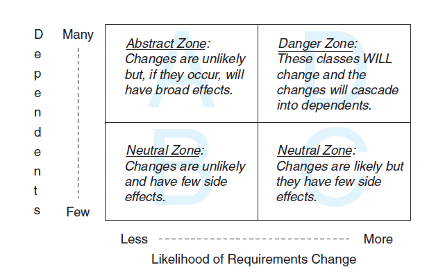
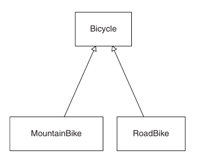
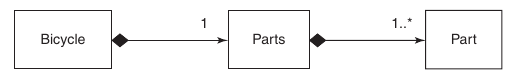

# Practical Object-Oriented Design in Ruby - Sandi Metz

## Agile Influences on Design

> You should build software in tiny increments, gradually
> iterating your way into an application that meets the customer’s true need.

> First, there is absolutely no point in doing a
> Big Up Front Design (BUFD) (because it cannot possibly be correct),
> and second, no one can predict when the application will be
> done (because you don’t know in advance what it will eventually do).

> If lack of a feature will force you out of business today it doesn’t matter how
> much it will cost to deal with the code tomorrow; you must do the best you can in the
> time you have. Making this kind of design compromise is like borrowing time from
> the future and is known as taking on technical debt. This is a loan that will eventually
> need to be repaid, quite likely with interest.

> Inexperienced programmers who do a lot of anticipatory design may never reach a point where their
> earlier design efforts pay off. Skilled designers who write carefully crafted code this
> morning may save money this afternoon.

## Single Responsibility Principle

Code should be easy to change:

- Changes have no unexpected side effects
- Small changes in requirements require correspondingly small changes in code
- Existing code is easy to reuse
- The easiest way to make a change is to add code that in itself is easy to change

Then the code you write should have the following qualities. Code should be:

- Transparent The consequences of change should be obvious in the code that is changing and in distant code that relies upon it
- Reasonable The cost of any change should be proportional to the benefits the change achieves
- Usable Existing code should be usable in new and unexpected contexts
- Exemplary The code itself should encourage those who change it to perpetuate these qualities

Something is worthy of being a class if it has both data and behaviour.

### Cohesion

> If the simplest description you can devise
> uses the word “and,” the class likely has more than one responsibility. If it uses the word
> “or,” then the class has more than one responsibility and they aren’t even very related.

### Don't Predict the Future

> This “improve it now” versus “improve it later” tension always exists. Applications
> are never perfectly designed. Every choice has a price. A good designer understands
> this tension and minimizes costs by making informed tradeoffs between the needs of
> the present and the possibilities of the future.

> Because you are writing changeable code, you are best served by
> postponing decisions until you are absolutely forced to make them. Any decision you
> make in advance of an explicit requirement is just a guess. Don’t decide; preserve your
> ability to make a decision later.

### DRY

> Behavior is captured in methods and invoked by sending messages. When you create
> classes that have a single responsibility, every tiny bit of behavior lives in one and only
> one place. The phrase “Don’t Repeat Yourself ” (DRY) is a shortcut for this idea. DRY
> code tolerates change because any change in behavior can be made by changing code
> in just one place.

### Hide Data Structures with Structs

> The official Ruby documentation (<http://ruby-doc.org/core/classes/Struct.html>)
> defines Struct as “a convenient way to bundle a number of attributes together, using
> accessor methods, without having to write an explicit class.”

Within a class to "wheelify" a 2d array structure into mini Wheel structs:

```ruby
Wheel = Struct.new(:rim, :tire)
def wheelify(data)
  data.collect { |cell| Wheel new(cell[0], cell[1]) }
end
```

Now only the `wheelify` method needs to change if the data structure changes.

### Splitting Methods

Where you can, split responsibilities out of methods. i.e.rather than a `diameters` method iterating over an array and calculating the diameter, extract a `diameter` method to do the calculation, and the `diameters` method iterates calling `diameter`.

```ruby
def diameters
  wheels.collect {|wheel|
  wheel.rim + (wheel.tire * 2)}
end

# instead do

def diameters
  wheels.collect {|wheel| diameter(wheel)}
end

def diameter(wheel)
  wheel.rim + (wheel.tire * 2))
end
```

Now the `diameter` method can be used elsewhere if you only need one diameter for something.

Methods with a single responsibility are:

- **Expose previously hidden qualities** - Having each serve a single purpose clarifies the purpose of the class.
- **Avoid the need for comments** - method names are self documenting, so more and smaller methods increases documentation with less comments.
- **Encourage reuse** - Other programmers will reuse methods they can find instead of duplicating code.
- **Are easy to move to another class** - Easier to extract as they are already extracted from the other method.

## Managing Dependencies

### Recognising Dependencies

An object has a dependency when it knows:

- **The name of another class**. Gear expects a class named Wheel to exist.
- **The name of a message that it intends to send to someone other than self.**
  Gear expects a Wheel instance to respond to diameter.
- **The arguments that a message requires.** Gear knows that Wheel.new requires a
  rim and a tire.
- **The order of those arguments.** Gear knows the first argument to Wheel.new
  should be rim, the second, tire.

High dependency increases the likelihood that some class may need to change if their dependency changes.

### Writing Loosely Coupled Code

Always inject dependencies. This way you can change the default injection, and need not to change it elsewhere.

> It is not the
> class of the object that’s important, it’s the message you plan to send to it. Gear needs
> access to an object that can respond to diameter; a duck type, if you will.

A class should be agnostic of what it is collaborating with, all it needs to know is that it can send a message to this thing and it will be able to respond correctly.

If you cannot fully inject the class (in an existing application), Lazy initialisation is a good alternative. An example where wheel returns `@wheel`, assigning it with a new wheel instance if it is not already assigned.

```ruby
def wheel
  @wheel ||= Wheel.new(rim, tire)
end
```

Isolate vulnerable external messages by extracting parts of methods that refer to dependencies to their own helper methods. Now if the dependency changes it is simple to know where to look to make any changes.

```ruby
def gear_inches
  #... a few lines of scary math
  foo = some_intermediate_result * diameter
  #... more lines of scary math
end

def diameter
  wheel.diameter
end
```

Remove argument order dependencies by passing arguments as a hash, and letting the dependency sort it out. This leads to a higher volume of code now, but less likelihood that changes will cascade into dependents later.

Keys in the hash also are self documenting.

```ruby
class Gear
  attr_reader :chainring, :cog, :wheel
  def initialize(args)
  @chainring = args[:chainring]
  @cog = args[:cog]
  @wheel = args[:wheel]
  end
  # ...
end

Gear.new(
  chainring: 52,
  cog: 11,
  wheel: Wheel.new(26, 1.5)
)
```

Or use keyword arguments!

> An object whose
> purpose is to create other objects is a factory

### Managing Dependency Direction

In the examples Gear is injected with a Wheel, however it could be done the opposite way.

The dependency direction should be towards the thing that changes least often. I.e. if gear changes a lot, wheel should be injected as a dependency.

- Some classes are more likely than others to have changes in requirements.
- Concrete classes are more likely to change than abstract classes.
- Changing a class that has many dependents will result in widespread consequences.

Recognizing Concretions and Abstractions.

Refering to things that are specific (such as particular arguments and their order) is concrete.

Refering to things that you have less knowledge of (i.e. it responds to diameter, but we don't know what it is) is abstract.

> When you inject Wheel into Gear such that Gear then depends on a Duck
> who responds to diameter, you are, however casually, defining an interface. This interface
> is an abstraction of the idea that a certain category of things will have a diameter.

Dependent-laden classes will be under massive pressure not to change, as you don't want to upset their dependents. This will handicap the agility of the application. Don't do it.

Zones A B and C are safe. D is not.



## Creating Flexible Interfaces

> Design, therefore, must be concerned with the messages that pass between objects.
> It deals not only with what objects know (their responsibilities) and who they
> know (their dependencies), but how they talk to one another.

A kitchen has a public interface, the menu, and the order is a message to the kitchen. There are many internal private message within the kitchen, however.

> Using a menu avoids this problem by letting each customer ask for what they want
> without knowing anything about how the kitchen makes it.

Public interfaces:

- Reveal its primary responsibility
- Are expected to be invoked by others
- Will not change on a whim
- Are safe for others to depend on
- Are thoroughly documented in the tests

Private interfaces:

- Handle implementation details
- Are not expected to be sent by other objects
- Can change for any reason whatsoever
- Are unsafe for others to depend on
- May not even be referenced in the tests

> Instead of deciding on a class and then figuring out its responsibilities, you are
> now deciding on a message and figuring out where to send it.
> You don’t send messages because you have objects, you have objects because you
> send messages.

### Context Independant Interfaces and Trust

Messages between classes should be declarative, not imperative. They should ask for "what" not "how". For example, ask the mechanic to service the bicycle, rather than telling the mechanic to oil the chain, check the brakes etc. These should be part of the mechanics private interface, and the public interface is service the bicycle, reducing the likelihood that the mechanic's public interface will change in future, reducing dependency coupling.

In the best case, the trip asks the mechanic to prepare the trip. the mechanic's private workings knows that means servicing the bikes. Combined with dependency injection:

> Trip doesn’t know or care
> that it has a Mechanic and it doesn’t have any idea what the Mechanic will do. Trip
> merely holds onto an object to which it will send prepare_trip; it trusts the receiver
> of this message to behave appropriately.

Now trip can be extended with many things that prepare it by injecting different things that respond to `prepare_trip` and prepare in different ways.

> If objects were human and could describe their own relationships, in Figure 4.5
> Trip would be telling Mechanic: “I know what I want and I know how you do it;” in
> Figure 4.6: “I know what I want and I know what you do” and in Figure 4.7: “I know
> what I want and I trust you to do your part.”

### Discovering Classes From Messages

If the message doesn't seem that it is a responsibility for any of your existing classes, perhaps it should be received by a new class. For example the customer shouldn't ask for suitable trips to a Trip, then suitable bikes from a Bike class. But it shouldn't need to, it could ask suitable trips from a Trip Finder class, which then asks trip for suitable trips, then for each trip found ask Bike for suitable bikes available.

### Rules of Thumb for Good Interfaces

Every time you create a class, declare its interfaces. Methods in the public
interface should:

- Be explicitly identified as such
- Be more about what than how
- Have names that, insofar as you can anticipate, will not change
- Take a hash as an options parameter

### Interacting with Classes

- Only call their public methods.
- Minimise context, interact with other classes as little as you possibly can, inject dependencies, and abstract knowledge to messages only.

### The Law of Demeter

> Demeter is often paraphrased as “only talk to your immediate neighbors” or “use only one dot.”

Avoid using chained messages to reach to behaviour of distant objects.

```ruby
customer.bicycle.wheel.tire
customer.bicycle.wheel.rotate
```

Each chained message is knowledge this class has on the result of the preceding message. Which is too much in these examples.

- Changing tire or rotate may break something in depart. Because Trip is distant and apparently unrelated, the failure will be completely unexpected. This code is not **transparent**.
- If wheel changes tire or rotate, depart may have to change. Trip has nothing to do with wheel yet changes to wheel might force changes in Trip. This unnecessarily raises the cost of change; the code is not **reasonable**.
- Trip cannot be reused unless it has access to a customer with a bicycle that has a wheel and a tire. It requires a lot of context and is not easily **usable**.
- This pattern of messages will be replicated by others, producing more code with similar problems. This style of code, unfortunately, breeds itself. It is not **exemplary**.

```ruby
hash.keys.sort.join(', ')
```

Although this has many dots, hash.keys, and .sort return Enumerables, and join acts on that enumerable. It doesn't reach to far off objects, only manipulates a near one.

Delegate to the object you are calling, which calls the next dot etc.

## Reducing Costs with Duck Typing

> Duck types are public interfaces that are
> not tied to any specific class. These across-class interfaces add enormous flexibility to
> your application by replacing costly dependencies on class with more forgiving
> dependencies on messages

> Duck typed objects are chameleons that are defined more by their behavior than
> by their class. This is how the technique gets its name; if an object quacks like a duck
> and walks like a duck, then its class is immaterial, it’s a duck.

A class could be many ducks, with more than one public interface incorporated in it.

> Users of any object can blithely expect it
> to act like any, or all, of the public interfaces it implements. It’s not what an object is
> that matters, it’s what it does.

Objects of the same duck type ought to implement the same public interface. This may mean providing different

### Polymorphism

> Polymorphism in OOP refers to the ability of many different objects to
> respond to the same message. Senders of the message need not care about
> the class of the receiver; receivers supply their own specific version of the
> behavior.

> Polymorphic methods honor an implicit bargain; they agree to be inter-
> changeable from the sender’s point of view.

You can replace the following with ducks:

- Case statements that switch on class
- kind_of? and is_a?
- responds_to?

> This knowledge exposes a lack of trust in collaborating objects and acts as a
> millstone around your object’s neck. It introduces dependencies that make code
> difficult to change.

## Acquiring Behaviour Through Inheritance

> Inheritance is, at its core, a mechanism for automatic message
> delegation. It defines a forwarding path for not-understood messages. It creates
> relationships such that, if one object cannot respond to a received message, it delegates
> that message to another. You don’t have to write code to explicitly delegate the
> message, instead you define an inheritance relationship between two objects and the
> forwarding happens automatically.

A concrete class can be extended by more abstract classes that add some additional behaviour or data.

Adding behaviour that would be specific to a subclass to the superclass muddies the Single Responsibility of the superclass.

> Some of Bicycle’s behavior applies to all bicycles, some only to
> road bikes, and some only to mountain bikes. This single class contains several different,
> but related, types.
> This is the exact problem that inheritance solves; that of highly related types that
> share common behavior but differ along some dimension.

If a subclass receives a message it does not know how to respond to, it delegates that to the superclass.

A subclass can redefine a message of the superclass, as the NillClass does with the nil? message (true), redefining the Object superclass (false).

### Using Inheritance

Here the MountainBike inherits from Bicycle, its initialise calls super passing in the args hash to the superclass's initialize method.

Its spares method calls the superclass's spares method (returns a hash) and merges in the rear_shock key and value.

```ruby
class MountainBike < Bicycle
  attr_reader :front_shock, :rear_shock

  def initialize(args)
    @front_shock = args[:front_shock]
    @rear_shock = args[:rear_shock]
    super(args)
  end

  def spares
    super.merge(rear_shock: rear_shock)
  end
end
```

### Abstract Classes



The above shows MountainBike and RoadBike inheriting from superclass Bicycle, which is an abstract class: it is never intended to be instantiated by itself, only as one of the subclasses.

> Abstract classes exist to be subclassed. This is their sole purpose. They provide a
> common repository for behavior that is shared across a set of subclasses - subclasses
> that in turn supply specializations.

When planning Abstract classes, if there is only one subclass it isn't needed. Anticipating more subclasses is also not helpful, as you don't know what the abstract class should hold in common for the subclasses until they need to be implemented.

Do push down code from the superclass to subclass, then bring back up bits of abstract code that all subclasses can share. It is better for subclasses to hold on to more abstraction than they need, than for a superclass to have concretions (code that does not apply to all subclasses) they shouldn't have.

> When a bit of the abstraction gets left behind, the oversight becomes visible as soon
> as another subclass needs the same behavior. In order to give all subclasses access to the
> behavior you’ll be forced to either duplicate the code (in each subclass) or promote it (to
> the common superclass).

### Hooks

> Instead of allowing
> subclasses to know the algorithm and requiring that they send super, superclasses can
> instead send hook messages, ones that exist solely to provide subclasses a place to con-
> tribute information by implementing matching methods. This strategy removes
> knowledge of the algorithm from the subclass and returns control to the superclass.

A "hook" method within the abstract class's initialiser forgives you for forgetting to call super in initialise of a subclass, as does the local_spares hook.

```ruby
class Bicycle
  def initialize(args={})
    @size = args[:size]
    @chain = args[:chain] || default_chain
    @tire_size = args[:tire_size] || default_tire_size

    post_initialize(args)
  end

  def post_initialize(args)
    nil
  end

  def spares
    {
      tire_size: tire_size,
      chain: chain
    }.merge(local_spares)
  end

  def local_spares
    {}
  end
  # ...
end

class RoadBike < Bicycle
  def post_initialize(args)
    @tape_color = args[:tape_color]
  end

  def local_spares
    {tape_color: tape_color}
  end
  # ...
end
```

## Sharing Role Behaviour with Modules

Roles exemplified by duck types (e.g. preparers), often suggest there is a parallel role for these types to handle (e.g. preparables).

Groups of class independent methods are generally called modules, which can be mixed in to an existing class. DRYing up code that is incorporated between sister subclasses, but not all subclasses.

The total set of messages to which an object can respond includes:

- Those it implements
- Those implemented in all objects above it in the hierarchy
- Those implemented in any module that has been added to it
- Those implemented in all modules added to any object above it in the hierarchy

The individual schedulable duck type should respond to shedulable, knowing their lead-days, and checking to see if they are available against its injected schedule which holds the scheduled dates.

Schedulable can be a module that can be mixed in to several classes that are schedulable.

```ruby
module Schedulable
  attr_writer :schedule

  def schedule
    @schedule ||= ::Schedule.new
  end

  def schedulable?(start_date, end_date)
    !scheduled?(start_date - lead_days, end_date)
  end

  def scheduled?(start_date, end_date)
    schedule.scheduled?(self, start_date, end_date)
  end

  # includers may override this hook
  def lead_days
    0
  end
end
```

### Antipatterns to Watch Out For

> First, an object that uses a variable with a name like type or category to
> determine what message to send to self contains two highly related but slightly
> different types.

> Second, when a sending object checks the class of a receiving object to deter-
> mine what message to send, you have overlooked a duck type.

> In addition to sharing an interface, duck types might also share behavior. When
> they do, place the shared code in a module and include that module in each class or
> object that plays the role.

### Liskov Substitution Principle

> Let q(x) be a property provable about objects x of type T. Then q(y)
> should be true for objects y of type S where S is a subtype of T.

> In order for a type system to be sane, sub-types must be substitutable for their supertypes.

A subclass should never rescind anything a superclass does, and a superclass should in some way do anything anything of its subclasses does. Otherwise the subclass isn't really "a kind" of the superclass.

### General Advice

Always use hooks over calling super in subclasses

Always use shallow heirarchies, they can be as wide as you like. Depth increases dependencies in the chain.

## Combining Objects with Composition

Composition is an alternative to inheritance.



A one to one relationship between bicycle and parts, and a one to many relationship between parts and part.

> It is confusing to use the word “parts” to refer to a collection of Part
> objects, when that same word already refers to a single Parts object. However, the
> previous phrase illustrates a technique that side steps the communication problem;
> when discussing Part and Parts, you can follow the class name with the word
> “object” and pluralize “object” as necessary.

> Perhaps Parts is an Array, albeit one with a bit of extra behavior. You could
> make it one; the next example shows a new version of the Parts class, now as a subclass
> of Array.

```ruby
class Parts < Array
  def spares
    select {|part| part.needs_spare}
  end
end
```

However this has issues where combining a Parts with another Parts with "+" results in an array that does not respond to spares.

Instead we can do the following:

> The Parts class below delegates size and each to its @parts array
> and includes Enumerable to get common traversal and searching methods.

Forwardable allows delegation to parts for size and each, and Enumerable allows things like sort etc.

```ruby
require 'forwardable'
class Parts
  extend Forwardable
  def_delegators :@parts, :size, :each
  include Enumerable

  def initialize(parts)
    @parts = parts
  end

  def spares
    select {|part| part.needs_spare}
  end
end
```

### Use Factories to Create Objects From Data

Using a factory we can take a 2d array like this:

```ruby
road_config = [
  ['chain', '10-speed'],
  ['tire_size', '23'],
  ['tape_color', 'red']
]

mountain_config = [
  ['chain', '10-speed'],
  ['tire_size', '2.1'],
  ['front_shock', 'Manitou', false],
  ['rear_shock', 'Fox']
]
```

Which is more concise than creating a bunch of objects manually and putting them into an array in the parts initialiser.

The PartsFactory takes a config 2d array as above, names for the part and parts class, initialises the parts class by mapping through creating new part objects from each element of the config.

```ruby
module PartsFactory
  def self.build(config, part_class = Part, parts_class = Parts)
    parts_class.new(
      config.map {|part_config|
        part_class.new(
          name: part_config[0],
          description: part_config[1],
          needs_spare: part_config.fetch(2, true)
        )
      }
    )
  end
end

mountain_parts = PartsFactory.build(mountain_config)

```

This can be improved using OpenStruct objects, which are similar to Structs, though they are initialised with a hash, argument order agnostic.

The part class is a bit overkill as we basically just use it as a container for data. It takes no additional behaviour

```ruby
require 'ostruct'
module PartsFactory
  def self.build(config, parts_class = Parts)
    parts_class.new(
      config.map { |part_config| create_part(part_config) }
    )
  end

  def self.create_part(part_config)
    OpenStruct.new(
      name: part_config[0],
      description: part_config[1],
      needs_spare: part_config.fetch(2, true)
    )
  end
end
```

New kinds of bikes can easily be made:

```ruby
recumbent_config = [
  ["chain", "9-speed"],
  ["tire_size", "28"],
  ['flag', 'tall and orange']
]

recumbent_bike = Bicycle.new(
  size: 'L',
  parts: PartsFactory.build(recumbent_config)
)
```

### Aggregation vs Composition

Composition is where the objects the thing is composed of are completely encapsulated by the whole, and do niot act independently of the whole.

Aggregation is where the objects are part of a thing, but are independent in their own right also.

### Inheritance vs Composition

> For the cost of arranging objects in a hierarchy, you get message delegation for free.
> Composition is an alternative that reverses these costs and benefits. In composition,
> the relationship between objects is not codified in the class hierarchy; instead
> objects stand alone and as a result must explicitly know about and delegate messages
> to one another. Composition allows objects to have structural independence, but at
> the cost of explicit message delegation.

> If you cannot explicitly
> defend inheritance as a better solution, use composition. Composition contains far
> fewer built-in dependencies than inheritance; it is very often the best choice.

Inheritance Benefits:

- Reasonable: small changes can introduce new behaviour to many subclasses.
- Usable: Hierarchies are excellent for open-closed, they can be extended with more subclasses, and the existing subclasses remain unaltered.
- Exemplary: The existing subclasses are examples of how new subclasses should be implemented.

Cost of Inheritance:

- Flipside of reasonable: The high cost of making changes near the top of the hierarchy, a small change implemented poorly can have major knock on effects.
- Flipside of usable: When subclasses represent a mixture of types (recumbent mountainbike).
- Flipside of exemplary: You shoulnd't extend poorly modelled hierarchies.

Composition Benefits:

- Transparent: small objects are easy to understand, no side effects from hierarchical changes.
- Reasonable: new composite parts can be added because its easy to understand the interface/duck type they honour.
- Usable: well defined interfaces of composite parts are easy to swap in and out.

Cost of Composition:

- Flipside of transparent: while the parts may be simple, the whole may not be.
- Also, delegation of messages needs to be known explicitly, there is no inheritance chain to look through.

### Which to Choose

- “Inheritance is specialization.” _— Bertrand Meyer, Touch of Class: Learning to Program Well with Objects and Contracts_
- “Inheritance is best suited to adding functionally to existing classes when you will use most of the old code and add relatively small amounts of new code.” _— Erich Gamma, Richard Helm, Ralph Johnson, and John Vlissides, Design Patterns: Elements of Reusable Object-Oriented Software_
- “Use composition when the behavior is more than the sum of its parts.” _— paraphrase of Grady Booch, Object-Oriented Analysis and Design_

**Use inheritance for _is-a_ relationships:**

- when the things are all variations of the indivisible idea, spreading out in a shallow hierarchy.

> The hierarchy’s small size makes it understandable, intention revealing, and
> easily extendable. Because these objects meet the criteria for successful use of
> inheritance, the risk of being wrong is low, but in the unlikely event that you are
> wrong, the cost of changing your mind is also low.

**Use Duck types for _behaves-like-a_ relationships:**

- many varied things might share behaviour (e.g. schedulables), so model those with shared Duck Type interfaces and behaviour.

> Your design task is to recognize that a role exists, define the interface of its duck
> type and provide an implementation of that interface for every possible player.

**Use composition for _has-a/many_ relationships:**

- things can generally contain other things, so should be composed.
- the further you drill down, you may find specific parts that have variants that can be modelled with composition.

> The more parts an object has, the more likely it is that it should be
> modeled with composition. The deeper you drill down into individual parts, the more
> likely it is that you’ll discover a specific part that has a few specialized variants and is
> thus a reasonable candidate for inheritance.

## Designing Cost-Effective Tests

Refactoring:

> Refactoring is the process of changing a software system in such a way
> that it does not alter the external behavior of the code yet improves the
> internal structure.

Martin Fowler in Refactoring: Improving the Design of Existing Code

> Good tests weather
> code refactorings with aplomb; they are written such that changes to the code do not
> force rewrites of the tests.

### Intentional Testing
