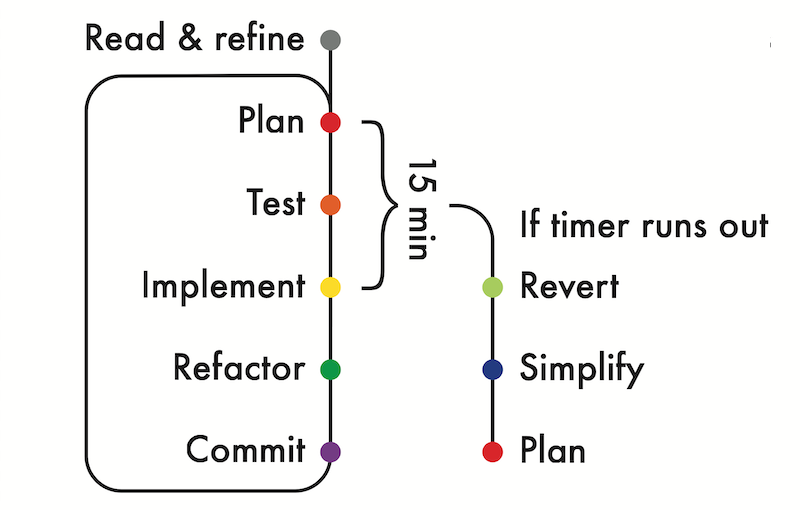

# Process Workshops

[Back to Course Goals](README.md) | [Source](https://github.com/makersacademy/skills-workshops/tree/master/process_review)

Process workshops are an opportunity to watch others code, have them watch you code, and to feedback on your coding processes.

- Write an input output table
- Start with the most simple example of input output
- Consider the dimensions of the problem

## 23 March

Attempted 10 Minute Walk

Feedback:

- Make a plan/domain model first
- Use IRB for manual test first
- Feature test first, then unit test
- Commit after each test passes

## 25 March

Attempted Middle Letter

Feedback:

- Start with the simplest example of input output first ("A").
- Then do the next simplest.
- Make a clunky if else block solution before refactoring.
- Make it work ugly before you make it work pretty.

## 6 April

Attempted Leap Years

