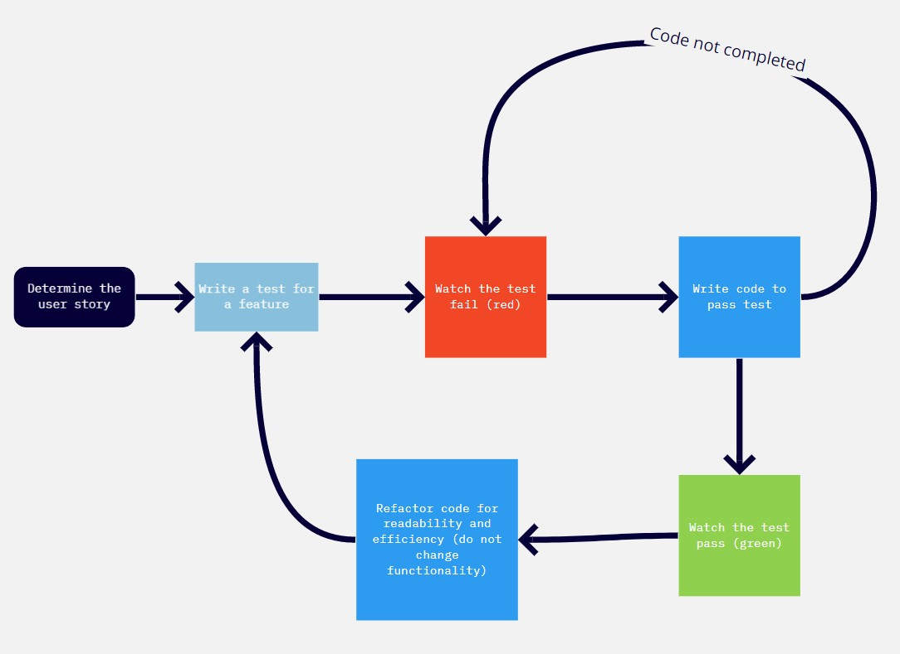

# The TDD Process - Skills Workshop

[All Workshops](README.md) | [Skills Workshop Source](https://github.com/makersacademy/skills-workshops/blob/master/week-1/TDD_process.md) | [Additional notes](https://github.com/makersacademy/course/blob/master/pills/tdd.md)

**Learning Objectives**

- [X] Explain why we do TDD
- [X] Describe/diagram TDD as a set of steps
- [X] Apply TDD following the diagram

**Achievement Plan**

- [X] Follow the TDD process to create a dice app
- [X] Create a specification from User stories
- [x] Practice writing TDD tests in `rspec`

**Evidence**

I have worked on creating an TDD'd [dice app](https://github.com/hturnbull93/dice-app)

## Notes

### Why do we write tests?

- To check the functionality of the program is what we expect it to be
- To make sure any changes to the program in the future do not break functionality
- To make sure program doesn't do things we do not want
- To force you to think about what you want out of ythe program
- To demonstrate things about the program

### Why do we write tests before production code?

- To break down what we want to achieve into smaller pieces
- So we do not write tests to justify production code that has already been written
- Tests allow design to emerge from their satisfaction
- **Testing is about what it does, not how it does it** (user doesn't care what is inside as long as it works)
- So we do not write production code to solve problems we do not have

### TDD mantra

TDD is about doing the smallest incremental steps:
- Only write the simplest test in order to fail
- Only write production code to pass a test
- Don't write more code than is needed to pass a test

### TDD Diagram

- User story
- Informs specification
- Write test for that specification feature -> 
- **RED:** Code fails test (as it not yet written)
- **GREEN:** Write the simplest possible code to pass the test
- **REFACTOR:** Reorganise your code for readability and processing optimisation, but no not change functionality.
- Write the next test

Diagram:

### Feature Tests vs Unit Tests

Feature Test (AKA Acceptance test)
- Test the program with things a user would demand
- Checks the program works properly for the user, with all parts interacting correctly overall
- Written from a user's perspective, checking on functionality

Unit Test
- Test an individual function or method, with mocked up dependancies
- Checks this individual part does what you expect
- Written from a programmers perspective, checking on parts that a user will never see

### Examples of User Story

User Story Structure | Example 1 | Example 2
---------|----------|---------
Who the story is from | As a board game player, | As a board game player,
The reason for this feature | So that I can play a game | So that I know how many steps I should move
What feature they want | I want to be able to roll a dice | Rolling a dice should give me a number between 1 and 6

### Domain Model

Take the nouns and verbs from user stories and place them into a table.

- Nouns -> Objects
- Verbs -> Messages

Objects model objects, and Messages model methods.

Objects | Messages 
---------|----------
Board game player |  
Developer |  
Dice | roll   1-6 randomly   any number of dice   total score
Game | record rolls

### BDD - Behaviour Driven Development 

[Source](https://github.com/makersacademy/course/blob/master/pills/bdd.md)

- AKA Outside-In development

- BDD helps you to only do as much as you need to pass feature tests, meaning your codebase will be lean and as simple as possible.

- BDD reduces over-engineering.

- Users want features that work, they don't care at all about the code.

- Developers like nice clean code.