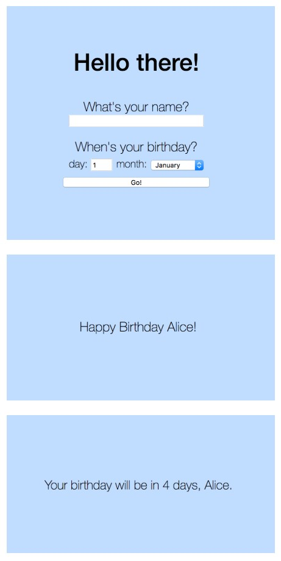

# Birthday Greeter App - Skills Workshop

[All Workshops](README.md) | [Source](https://github.com/makersacademy/course/blob/master/intro_to_the_web/post_challenges/birthday_app.md)

Learning Objectives

- [ ] Practice networking, building servers, and handling HTTP request/response cycle

Achievement Plan

- [ ] AP

Evidence

- Evidence 1

## Practical

Create an web app that allows users to enter their name, their birthday, and will tell them "Happy Birthday" or tell them how many days until their birthday.

An example:

### Getting a Homepage

- Created a directory, initialised git and bundler, and required Sinatra in the gemfile, and bundled.

- Added an app dir, and created birthday_app.rb in it:

  - Required sinatra
  - Wrote a sinatra get do for '/', the homepage, returning "Hello there!"

- localhost:4567 shows "Hello there!"

###
