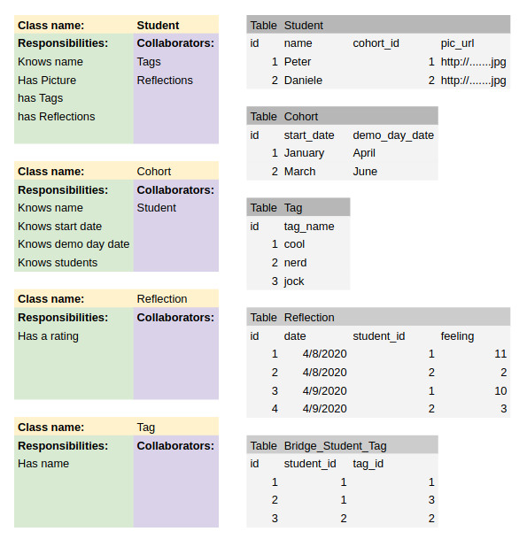

# Database Domain Modelling - Skills Workshop

[All Workshops](README.md) | [Source](https://github.com/makersacademy/skills-workshops/blob/master/week-4/domain_modelling_student_directory_using_crc_cards/README.md)

Learning Objectives

- [x] Explain how to use CRC cards to model a domain
- [x] Model a simple domain using CRC cards
- [x] Infer database structure from domain structure

Achievement Plan

- [x] Create a Domain Model using CRC Cards
- [x] Infer a Table Schema from the CRC Cards

Evidence

- I have created a domain model and table schema from the below User Stories.

## Notes

### CRC Cards

Class Responsibility Collaborator Cards

A class has Responsibilities, what it knows and does.

A class has Collaborators, another class that it interacts with to fulfil its responsibilities.

### Database Relationships

| Name         | Relationship                                       | Example                               |
| ------------ | -------------------------------------------------- | ------------------------------------- |
| One to One   | One thing relates to another thing                 | A bike has one current user           |
| Many to One  | Many of one thing relates to one of another thing  | There are many students in one cohort |
| Many to Many | Many of one thing relates to many of another thing | Any student may have any of the tags  |

### Practical

#### User Stories

> As a coach  
> So I can get to know all students  
> I want to see a list of students' names
>
> As a coach  
> So I don't get overwhelmed with a massive list of everyone  
> I want to filter the list of students by cohort name
>
> As a coach  
> So I can prepare for Day One and Demo Day  
> I want to see the start date and demo day date of a cohort
>
> As a coach  
> So I can learn students' names  
> I want each student's name to link to the URL of a picture of the student
>
> As a coach  
> So I can mark certain students  
> I want to tag a student with many named tags
>
> As a coach  
> So I can see students with the same tag  
> I want to filter students in the list by tag name
>
> As a student  
> So I can reflect on my days  
> I want to rate each day out of 10
>
> As a coach  
> So I can get an overview of feedback  
> I want to see an average of the day ratings for each student

#### CRC Cards and Table Schema

