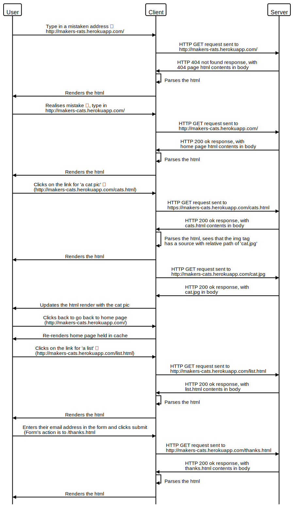

# Process Modelling - Skills Workshop

[All Workshops](README.md) | [Source](https://github.com/makersacademy/skills-workshops/tree/master/week-3/process_modelling)

Learning Objectives

- [x] Define process modelling as a tool to describe and understand a process.
- [x] Use process modelling to further your understanding of HTTP requests and responses.

Achievement Plan

- [x] Create a process model for HTTP requests and responses.

Evidence

- I have written a sequence diagram for the HTTP request/response cycle, [see below](#sequence-diagrams).

## Notes

### What is a Process Model

Writing a process model is much faster than writing actual code, allowing you to map out a process much faster before starting

Much quicker to iterate and change in a model over real code.

The human brain can only hold 6 or 7 things in short term memory, so the model is a useful guide when it comes to writing the code.

### Sequence Diagrams

